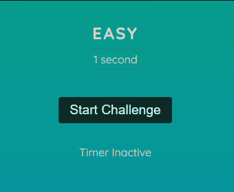
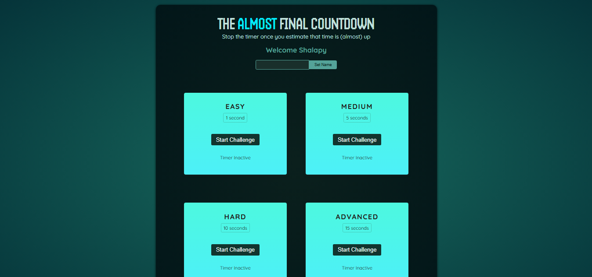

<div id="top"></div>

[](https://react.dev/)


<!-- PROJECT LOGO -->
<br />
<div align="center">
  <a href="https://react-reaction-timer.web.app/">
    
  </a>
  <h1 align="center">React-Reaction-Timer</h1>

  <p align="center">
    <a href="https://react-reaction-timer.web.app/">View Demo</a>
    ·
    <a href="https://github.com/SalahShallapy/React-Reaction-Timer/issues">Report Bug</a>
  </p>
</div>

The Reaction Timer Challenge is a demo React app built to demonstrate the use of `useRef` for timer control and `createPortal` for modal rendering. This project provides a practical understanding of working with references and portals while offering a fun challenge to test your reaction speed.

## Project Overview



## Features

- Start and stop the timer to achieve a high score.
- Dynamic score calculation based on reaction time.
- Modal pop-up implemented using `createPortal`.
- Clean and reusable component structure.

## How to Use

1. Start the timer by clicking **Start Challenge**.
2. Stop the timer as close to **0 seconds** as possible.
3. A modal will display your score and reaction time.

## Project Structure

```
React-Reaction-Timer
│
│      .gitignore
│      .vite.config
│      index.html
│      package-lock.json
│      package.json
│      README.md
│
│
└───public
│   vite.svg
│   overView.png
│
└───src
    │   App.jsx
    │   index.jsx
    │   index.css
    │
    ├───assets
    │       react.svg
    │
    ├───components
    │   │
    │   │  Player.jsx
    │   │  ResultModal.jsx
    │   │  TimerChallenge.jsx
    │   │
```

## Installation

To get started with the project locally:

1. Clone the repository:
   ```bash
   git clone https://github.com/SalahShallapy/React-Reaction-Timer.git
   ```
2. Navigate to the project directory:
   ```bash
   cd React-Reaction-Timer
   ```
3. Install dependencies:
   ```bash
   npm install
   ```
4. Run the project:

   ```bash
   npm run dev
   ```

## Contributing

Contributions are what make the open source community such an amazing place to learn, inspire, and create. Any contributions you make are **greatly appreciated**.

If you have a suggestion that would make this better, please fork the repo and create a pull request. You can also simply open an issue with the tag "enhancement".
Don't forget to give the project a star! Thanks!

1.  Fork the Project
2.  Create your Feature Branch (`git checkout -b feature/AmazingFeature`)
3.  Commit your Changes (`git commit -m 'Add some AmazingFeature'`)
4.  Push to the Branch (`git push origin feature/AmazingFeature`)
5.  Open a Pull Request

   <p align="right">(<a href="#top">back to top</a>)</p>
